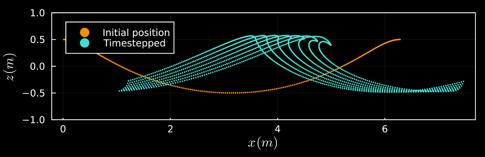

# Castawave


Castawave is a boundary element solver for free surface potential flows, specifically adadpted to handling nonlinear surface waves. The mixed Euler-Lagrangian method used is inspired by [Dold (1992)](https://www.sciencedirect.com/science/article/pii/002199919290327U).

This code base uses the [Julia Language](https://julialang.org/). It is authored by [Aidan Blaser](https://github.com/aidanblaser) & [Raphael Benamran](https://github.com/rbenamran).

To use it locally, do the following:

0. Download this code base. 
1. Open a Julia console and do:
   ```
   julia> using Pkg
   julia> Pkg.develop(path="path/to/Castawave")
   julia> using Castawave
   ```
   `Pkg.develop` registers Castawave as a local dependency of whatever
   project/environment is currently active, without copying or vendoring
   it - edits you make to this repo are picked up immediately.

See `scripts/QuickStart.jl` for a minimal, self-contained worked example
(it ships its own nested environment, `scripts/Project.toml`, so it needs
no manual setup beyond the one-time `Pkg.develop` + `Pkg.instantiate` shown
in that script's header comment).


